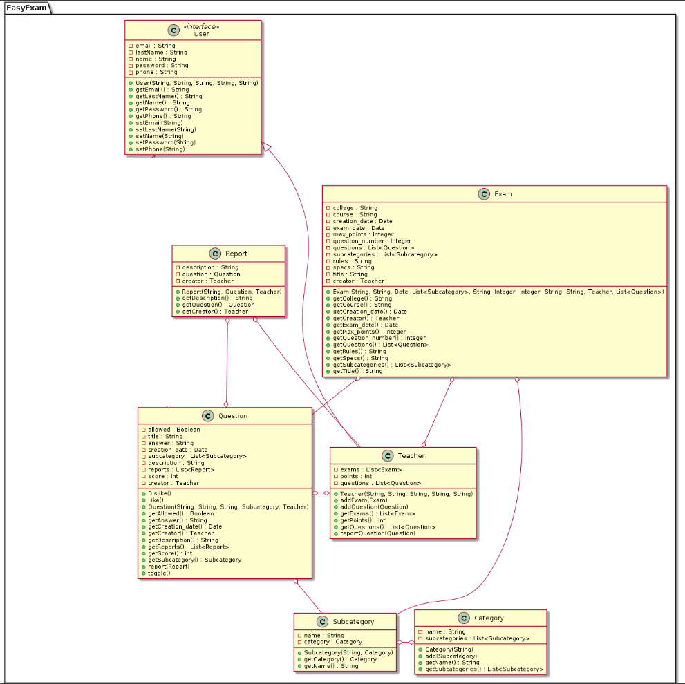

# Developer guide
## Introduction
Easy exam is a plataform that helps both students and teachers streamline the question creation and validation problem. It does so by allowing teachers to create exams, "buying" an amount of problems with the score of questions that they themselves uploaded previously. Said questions will be rated by the public, filtering out bad problems organically.
# Features
## Accounts
+ Account creation: register
  + Verify account credentials
+ Verification of user session with sessions in js
## User actions
### Teacher
+ Observe questions
    + Select questions
    + Rate question
    + See answers
+ Generate exam
    + Select Questions
+ Upload questions
    + Select question tags
    + Upload answers
+ Download exams 

## Diagrams

### Class Diagram

### Architecture

### View

### Controller

### Model

## Interaction Between Components

### Login

### Create Exam

## Glossary
 
 1. User: Someone who uses the plataform.
 2. Teacher: Someone who uploads questions or generates exams
 3. Tags: Categories created to sort questions
 4. Report: Complaint about a question, allows mod to take action
 5. Rate: To give feedback on a question by liking or disliking
 6. Score: The sum of all ratings on a question

