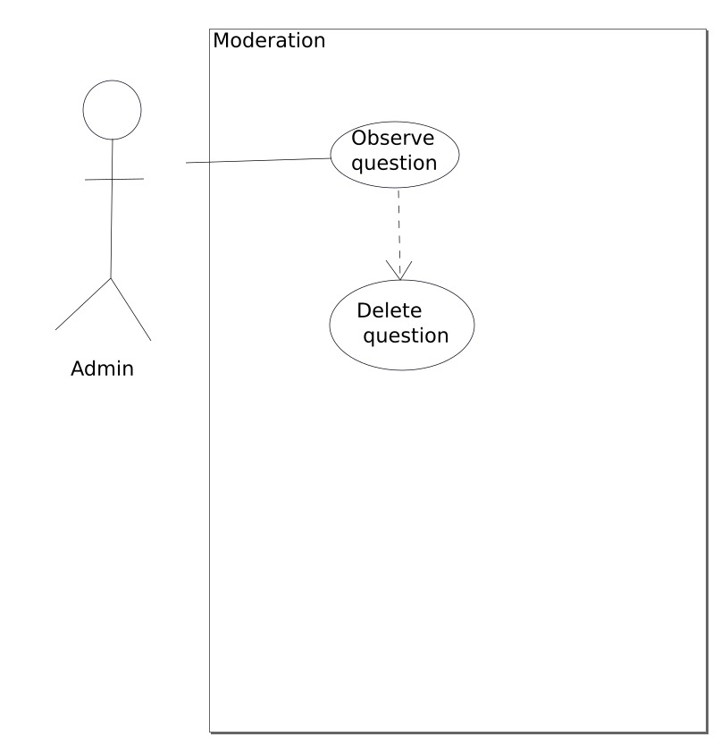
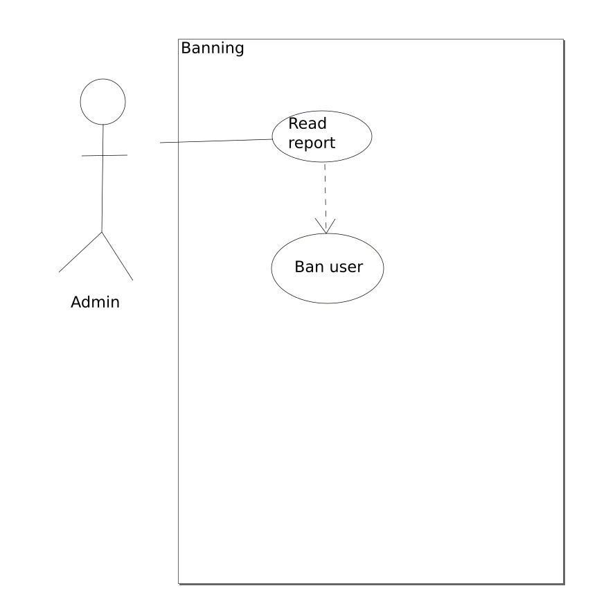

# **User Guide**

## **Target user profile, value proposition, and user stories**

### ***Target user profile***
Archibald, 45 , teaches software engineering at a top university. He enjoys contributing to stackoverflow, mathexchange and codereview. He needs to make a 80 question test for this course, so he ends up making 110 problems and discarding 30. He feels that there must be a better way to write his exams.

### ***Value proposition***
EasyExam te brinda la solucion a todos los problemas de crear un examen, te brinda un banco de preguntas al que eres libre de acceder para poder recoger preguntas para tu examen, ademas solo te pide que colabores con algunas preguntas para poder acceder a un repositorio centralizado de preguntas mantenido por la comunidad

## **Requirements**

### **Functional requirements**
* Como usuario debo de ser capaz de Iniciar Sesion correctamente de forma que pueda continuar mi uso de la herramienta
* Como usuario debo de ser capaz de Registrarme correctamente de forma que pueda comenzar con mi uso de la herramienta
* Como usuario debo de ser capaz de Recuperar mi contrasenha de forma que pueda recuperar mi cuenta
* Como profesor puedo subir mis preguntas a la plataforma de tal forma que contribuya con el crecimiento de la misma
* Como profesor puedo calificar una pregunta de tal forma que mejore e indique que preguntas son mas serias que otras
* Como usuario puedo editar mi perfil de tal forma que mi informacion siempre este actualizada
* Como usuario puedo ver las calificaciones se han realizado de tal forma que sepa que preguntas no son serias y cuales si
* Como administrador puedo banear cuentas de tal forma que no hayan cuentas falsas
* Como administrador puedo eliminar preguntas que considere no sean correctas
* Como usuario debo ser capaz de reportar a otras cuentas de tal forma que avise al sistema si hay alguna cuenta falsa
* Como profesor debo de ser capaz de descargar mis examenes en formato pdf de tal forma que este pueda ser mejor manejado y directamente impreso para su uso
* Como profesor puedo ver una preview de las preguntas de tal forma que me asegure que todo este bien colocado
* Como administrador puedo ver los reportes de los usuarios acerca de otras cuentas y otras preguntas
* Como profesor puedo filtrar las preguntas a la hora de hacer una busqueda de las mismas para agregarlas a mi examen

### **Non-functional requirements**
* Como profesor puedo crear un examen totalmente personalizado con los temas que yo elija
* Como usuario debo de tener una pagina responsive
* Como usuario debo de poder acceder al lugar el 90% de las veces
* Como usuario debo de poder descargar examenes rapidamente
* Como usuario debo de tener transiciones rapidas entre cada pagina

## **Features**

### **Principal**
* Integration of Spring and Angular 
* Database creation
### **Accounts**
* Creating account: ***register***
    * Verify account
* Verify Credentials: ***login***
    * Usage of tokens
### **User Actions**
#### **Teacher**
* Generate Exam
  * Choose Subject
* Post exercises 
* Review exercises
* Download exam/answers

#### **Admin**
* Mostrar las preguntas en revision
  * Eliminar las preguntas falsas o erroneas

## **Use Cases**
 ## 1. _Moderation_

* **Software System**: EasyExam (EE)
* **Use case**: UC01 - Moderation
* **Actor**: Admin,System(EE),Database
* **Preconditions**: 
    * Admin is logged in. 
    
* **Use case**:
    1. System sorts questions by ranking.
    2. Admin selects question.
    3. Admin reads question report.
    4. Admin reads question.
    5. Admin deletes question.
    6. Question is deleted from the Database.
    7. Use case ends.

## 2. _Banning users_

* **Software System**: EasyExam (EE)
* **Use case**: UC02 - Banning users
* **Actor**: User,Admin ,System(EE),Database
* **Preconditions**: 
    * User account currently exists. 
    * User's questions have been reported.
    
* **Use case**:
    1. Admin reads the reported user's questions.
    2. Admin approves ban.
    3. User account gets deleted from database.

## 3. _Password recovery_
* **Software System**: EasyExam (EE)
* **Use case**: UC03 - Password recovery
* **Actor**: User,System(EE) 
* **Use case**:
    1. User selects option forget password.
    2. User write his email.
    3. User opens a message with his new password.
    5. User use his new password to login.
    6. Use case ends.

## **Glossary**
 1. User: Someone who uses the plataform.
 2. Teacher: Someone who uploads questions or generates exams
 3. Moderator: Someone who has the power to delete users and questions
 4. Tags: Categories created to sort questions
 5. Report: Complaint about a question, allows mod to take action
 6. Rate: To give feedback on a question by liking or disliking
 7. Score: The sum of all ratings on a question

## **Survey and Interviews**

   There is two kind of surveys. The first survey was developed to students and the second survey was developed to professors. We gathered 22 surveys from students and 9 surveys from professors. Besides we made 2 interviews at UTEC. 
   The results of the data collection indicate that there is a high willingness on the part of the teachers to be able to use third-party material to be able to generate their exams. At the same time, they are willing to collaborate with giving exercises to the repository. Regarding the students, many of them answered the last question of the survey (would you be willing to practice with solved exercises online?) In a positive way to 100%. However, a high percentage of students said that not being sure that their answer is correct is one of the challenges they face when practicing problems for an exam.
   
   **Questions**:
   
1. ¿Dónde labora y que curso dicta?

2. ¿Se sentiría cómodo si cambia la manera en la que ha venido trabajando?   

3. ¿Cuáles son los principales problemas que afronta al generar un examen?

4. ¿De dónde suele recolectar las preguntas?

5. ¿Es abierto a compartir alguna pregunta de su examen a algún otro profesor?

6. ¿Qué herramientas utiliza en tu día a día?

7. ¿Qué determina la dificultad de un examen?

8. Al realizar un examen, ¿Tiene las soluciones de antemano o las realiza después? ¿Por qué?

9. ¿Utiliza plantillas para sus exámenes?

   **First Interview** : 
   
   Answer 1: Henry Gallegos , ICC
   
   Answer 2: Sí
   
   Answer 3: Encontrar un adecuado nivel de dificultad para el examen
   
   Answer 4: De algunas paginas web
   
   Answer 5: Sí
   
   Answer 6: Canvas, Hackerrank
   
   Answer 7: El análisis que implica resolver el problema
   
   Answer 8: Sí tengo las soluciones antes
   
   Answer 9: Sí
   
   **Second Interview** : 

   Answer 1: Teofilo Chambilla, Base de datos, POO 1
   
   Answer 2: Sí
   
   Answer 3:Diseñar las preguntas para los estudiantes
   
   Answer 4: Intercambia material con colegas (profesor. Heider)
   
   Answer 5: Sí
   
   Answer 6: Hackerrank, Drive
   
   Answer 7: Encontrar una solución de una forma no tan obvia
   
   Answer 8: Sí 
   
   Answer 9: Sí
   
   Links Student Survey :
   https://docs.google.com/forms/d/1xXwVFp3H4BrOxxErT0H3xJp7Dg65gsJmZnlvEMpLTOM
   
   Links Professor Survey :
   https://docs.google.com/forms/d/1rlYnMQLkwsUv3-l0O5UjqI_MbW8jMV34tQDTwbJTA5M
   
   
